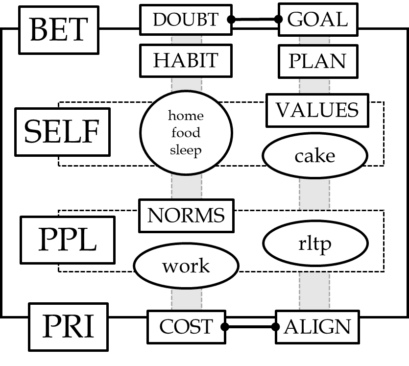

Dear Friend,  

You are going to die some day.
This book is for you if 
there is something in the meantime
worth maximizing.  

## how to read this book

The purpose of this book is for you to engage your life.

1-get a pencil and note the date and time, here: \_\_\_\_\_\_-\_\_\_\_\_\_-\_\_\_\_\_\_ `YYYY-MMDD-HHMM`.

2-in this box, \_\_\_\_  
if you:  
- did 1, write "2". you either are curious enough to try new things,
or lie about it.
- didn't do 1 and felt, "will do, but first let me read on.", write "1". you imagine you have the curiosity, and
you will be right once you write down the time, 
and you are a liar until this happens or you admit you qualify as a 0.
- didn't do 1 and felt, "that's dumb, strike 1 for this book," write "0". you could probably stop reading now, or admit you're a "1".

You can engage every word you read in this book with 0, 1, or 2.  
The only reason to read anything is for its potential impact on your life.
Therefore, I write with the intention to make such decisions and impact easier.
That is, where possible, the language is direct, perscriptive and strong.

The primary voice (COMM-STYLE) in this book is me as a 2 for assuming you're a 2. Further, I'm a 2 because what I write is testable, I've tried it, and I think it is better than alternative ways of dealing with the subject. This is radical "benefit of the doubt" regarding text (WORDS). 

A good consequence is this saves on many words of "justifying" why I'm telling you X or Y. I'm telling you because it is good, and you want to know what is good, and will minimally consider applying it to find out if it is good for you, and I would be ever so gracious if you shared with me what you determined after trying it.

It is not that I do away with nuance, but 
that I hope you spend more time thinking about your OWN nuance,
than worrying about mine.
I posit an idea in "loud" terms,
and you identify the appropriate volume for your own truth.
More on this can be found in [words].

The bad consequence is that it could seem a mystery if / why something is suggested. 
Why did I ask you to write down the time?
Because all of your life, the good and the bad, 
are most simply knowable, understandable, manipulable, in terms of time. 
The more you know how your life, your meaning, etc., 
relate to time, the more you understand your life, 
and have a chance to do something about it.
In this case, you now have 
a rough estimate of when you started reading this book.
It is a bookmark in your life. A moment.
It tells you nothing on its own,
but as things happen at later times,
it gives you a comparison point.
When you finish the book, when you started acting differently, when you started feeling better, etc.

### logistics
The book is organized into 
parts. 

Part One 
deals with the existential facts of life:
you experience it, and you have some control over it.
By bringing process and analysis to the thoughts
underlying your control,
you can investigate, change, and optimize 
the actions that most greatly improve your experiences.

To do so 
with expectations modest and robust enough
for most people to
responsibly and effectively benefit,
would be a fitting, improved "goal"
of the pedagogy of 
a mature education system.

As such,
part one deals with the facts of life
framed as an object of study
for a novice student.

It includes lessons
as examples
of how various challenges in life
may be intellectualized
for the benefit of the individual
without imposing an external value system.

The process of learning is called
SKILLED REFLECTION.
The idealized environment and learning culture
is called
the INTELLECTUAL BOOTCAMP.
Don't overthink these frames,
unless you're prepared to get dirty.

While life is about a physical relationship
with the world,
it is thoughts that have the power to change
the quality of life.
Words are as close as we can practically get
to investigating thoughts.

In plain words, Part Two deals with
the pros and cons of WORDS,
their common uses,
and a better way of engaging them,
for the purposes of
optimizing goals.

Without spelling out all the flaws,
Part two analyzes
the nature of limitations of words
and proposes lines of investigation
and revision to lead to better word use.

The key arguments are radical application of:
- brevity
- value-assessing
- clarity 

These are accomplished with concrete guidance on actions.

Figure 1 highlights key IDEAS and 
their basic associations,
to reduce potential confusion with lay-definitions.

Thanks to
the first student of the boot camp, 
who bet to publish the first edition.  

Thanks to those who didn't read it,
especially Nick and Bill,
to inspire me to write a second edition,
quickly, more brief and clear.

  
### Figure 1  
The relationship between core IDEAS of this book. 
These will appear throughout in capital letters. 
The first word in each row refers to a Chapter.  
  

## Introduction
The incremental science
we are familiar with
identifies a gap in knowledge, 
and proposes to fill it.

We began with YOUR understanding;
of yourself and your actions, first,
then of your immediate environment,
and then with extreme caution,
your beliefs about everything else,
including others' understanding, etc.

If we were to take everyone's above assessment,
some facts would emerge as universal:
things about eating and sleeping and dying,
for instance.
Most observations will vary,
but they will always connect to fundamental experiences.
In this way it is possible to collect and summarize
an empirical description of reality,
and all its possibilities from birth to death.
This is the ground truth for the intellectual boot camp (IBC),
and ideally, the rest of social sciences.

The core assumption is that
any improved empirical description in this way
will be useful for
both individual and collective issues
of the social sciences.

What an easy solution!
Unfortunately,
we don't already have it,
because of a number of methodological challenges.
To illustrate these issues, 
consider just a single, knowable event
that a person experiences.
what that person
- understands about themselves,
- and their experience,
- and makes of it,
- and reports,
will vary widely.

The primary purpose of this book
is to begin solving these problems,
by presenting YOU
with an approach to standardizing
your OWN experiences.
That is,
this book is a standard
for understanding and solving 
the problems in your life,
framed purely by your own terms.

### Problems

Before I elaborate on that objective,
let's review some fundamental problems 
in social science research.

There is no universal or ground truth for:  

#### Experience, Value   
(Read as: 
_There is no universal or ground truth for Experience, or Value._) 

It is difficult to give a rigorous, and unchanging answer to these questions.

What is the material (money) value of
- happiness?
- food?
- staying dry?

How much does it depend on
- how much sleep you've gotten the last week?
- your marital status?

#### rational action  
Given options A or B, what to do?
It turns out the answer is not always, "the better choice."
What _is_ the better choice?
What is the _popular_ choice?

These questions are 
the building blocks of what we aim for with
 education, intelligence, skills.

Whereas economists and behavioral research
have put humans in research labs 
to see which they choose,
I argue the necessary and more valid approach is 
to remind humans of making better choices 
out in their lives,
ask them to keep track of the ones they did,
why, and what happened 
(with as little time in the lab as possible).

That is precisely what the BET framework
attempts to accomplish. 
Its standardization lends for quantifying and summarizing many decisions.

Couple the above data with experiences and values, and we can interpret results for future problem-solvers, or, "educate our youth".
See "to Education" in Chapter 1.

#### Words  

Building on the last approach, we have great traction on 
one of the foundational problems in philosophy: 
the meaning of words.

The vast complexity and nuance of words,
its core intractability
comes from the assumption that
words are honest and clear.
They aren't, but by standardizing
communication, they could be.

This means removing politeness and authorship
from meaning making, using, and sharing.
Especially for the nature of science.
It gives meaning a chance to stand clearly.
If the meaning-makers obey the BET framework,
and work toward GOALS with PRI, SELF, and PPL in mind,
then we have a clear benchmark
against which to evaluate decisions, goals, and beliefs.

### Answers  
One of the most common pitfalls
to perspectives and solutions 
is to propose that
people change their behavior.

"If only so-and-so
would quit smoking,"
or "give a shit about global warming."

Ironically, it could be said
this book is the complete and universal
form of that fallacy,
albeit with a critical caveat:
I demand only all the change
that can and will happen,
of your own will.

I posit that the foundational,
universal change of behavior needed,
are the ones that YOU genuinely
assert you are ready to make.

This is the point of the book.
I will give you all the tools
to verify, let alone test and implement,
changes you claim you're ready for.

This is Skilled Reflection.

Each of the problems and solutions
presented above are
characterized honestly,
in terms of the selfish gain
YOU stand to make;
always, only at
a cost of change.

Still it is probably not enough
to overcome all habits.
So I also promote 
a culture and ethos of rational change.
It must be made artificially,
but, with immersion,
I bet this is sufficient
for it to be adopted fluently.

This is the IBC.

So, READER,
you are now equipped with the topics.

First, you will encounter
my worldview as a proposal
for an education program,
designed specifically for YOU.

Once you've walked through
its core mission, expectations, lessons,
Part two will take you
through the foundational concepts,
and key lines of reasoning
to fully implement the program
in your life.

After that, you're done.
Go bet on and 
live your better life.

For any of the academic types,
see me afterward.

## The Garden

The chapters on the Garden describe the key IDEAS of this book: the existential experience of being human--from the biological of eating and sleeping to thinking and meaning-making. The purpose is to illustrate the interdependence of mind and body (Garden-1), death and meaning (Garden-2), self and others (Garden-3).

"The Garden" is a description to be experienced. The purpose is for you to make
a Garden with the specifics of 
your own life, identity, and ambitions.
As a metaphor, the Garden helps foreground the things we often lose sight of when conceptualizing: life is brief and we are mortal.

Your ability to imagine your garden 
shows how the mental world 
can be strategic and powerful 
in bringing clarity to your reality. 
However, your mind can also be idealistic in ways that set you up for failure and suffering. 

### IDEAS and Plans  
The second part of each chapter
returns to reality.
"IDEAS and Plans" gives
clear, literal and concrete language 
to the key IDEAs and consequences (LINKs)
in "The Garden".

Definitions for IDEAS (ALL CAPS) are always 
describing some sense(s) of 
what you already know by the same name,
but LIMIT which relevant senses.
For example "WORK" is about careers,
but not 'yard work'.

Generally, this is to give
IDEAS measurable, consequential meaning.
See the chapters on WORDS 
for more.

You can read more about this in "PLANS"

A special case of plans is a LESSON.
The LESSONS are much like "The Garden",
meant to activate 
relevant parts of your reality or beliefs,
in a way that applies
the IDEAS introduced.
They are exercises that
take between 10 and 60 minutes to complete.
You can read more about them in "SR".

