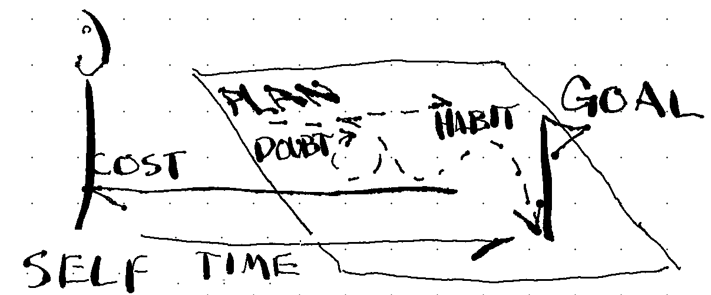

---
output:
  pdf_document: default
  html_document: default
---

# The Garden

## "Student vs. School"

**Task 1. 3m, 40w.**
List four course objectives
or program requirements that are
most on your mind right now. 

Courses impose a number of
conditions on your life:
1.  Fixed time: courses
2.  Variable time: assignments
3.  Uncertain time: studying
  

**Task 1. 3m, 40w.**
What are your top 4 goals for
the next 10 years?
you could work on any part of yourself, 
move toward any goal you want.
  
list four goals,
Each no longer than 10 words

**Task 3. 3m 40w**
Your current program requires things 
your 10 year plan does not. 
What's the difference?

### afterlude
Imagine a perfect course exists, 
designed to teach you
to fulfill your specific ambitions.
every aspect of what you NEED to know,
that is known and communicable,
is the only thing written.
everything that cannot be known
but must be discovered or practiced,
is laid out as a set of instructions,
described in the words that
maximize the learning opportunity, and your progress.

Rather than a course in a classroom,
the perfect class
is a manual to reference 
as you live your life,
or at least until you've internalized its contents:
when to take a break to strategize your decisions,
lessons on what opportunities to watch for and resist,
and so on.
Any social role you wish to take on,
artist, engineer, therapist, insurance salesperson,
reliable partner,
is customized intimately,
curated perfectly for 
what you need.

Any relationship, interpersonal skill,
that is realistically possible for you,
is preceded with the guidance and education
that prepares you emotionally
to choose the right experiences
that set you up to be most likely
to find and make the most of 
opportunities to share yourself with another.

If you then take this notion of a personal book
and consider one for all the humans in the world,
then identify what is in common,
in theory you have a description of
the social sciences.

This is silly to imagine,
because such books are far from reality. 
The thesis of *this* book
is that social sciences are 
missing a vital factor to
approximates such a book,
a census of all human thought and actions.

### to Education
(No one chose to be born.)
Everyone begins life 
with problems 
that do not have names. 

School books tell a student 
what the answer is not (quite).

The gap between problem
and book answers
is left for the student
to "apply".

ANSWER: 
let the student
Define the problem
through their
reality and life goals.

Let them write the plan
and teach them only
what is needed
to succeed. 

## Part One: Self 

Imagine your life is a garden. 
Every one of your life ambitions, GOALS,
is buried in the ground as seeds.
Finding a life partner, 
acquiring a car or promotion, or 
resolving a conflict with 
your childhood friend 
are all matters spread across the
dirt in need of water, sunlight, 
and---most important---your time. 

Other goals, like naps, 
your favorite hobbies, or TV shows, 
take little work and
grow almost anywhere. 
Whether they are dear to you or weeds, 
if they take your time, 
they are in your garden.

### today

Today, you are on one end looking out across the
entire garden. 
What has already been planted? 
What will you add and how
much time will you devote to those goals? 
Every seed you plant
---  even an abstract one 
like passing a course or making a friend---
implies things 
in and out of your control 
like work and weather, or 
beyond your awareness,
like what your boss loses sleep over.
  
Meditate on the final products of your garden. 
Is there a more important plant 
that deserves your time today? 

Meditate on the prioririties of your work. 
Do two plants grow better when together? 

Make a quick and accurate assessment,
but don't sit here all morning 
thinking about it.
A garden is for working in,
to get the goods you need.
What do you need to cultivate, 
today?
What do you want to cultivate 
in this life? 

### L4: Time
These are two exercises that
can be used to plan your day.
They are set up in a way
that confronts one of the most common
mistakes of planning:
being unrealistic in your expectations.

#### A. Typical Day
Think about a day and how much time you
spend on various activities, averaged over 365 days in a year. 
Then pick a GOAL,
and estimate the changes
required to make it happen. 
The first step reflects your HABITS, 
and the changes reflect COSTS.
  
__Table 3. __First approximation of how my time is
spent (hours), sorted by GOALS and subgoals, and any details that are
worth noting. Hours total 24, and assume 365 days / year. Non-daily
activities such as visiting the dentist are factored in, accordingly.
Second approximation (ideal) reflects where I would like to be over the
next 3-4 months of my life.
  
#### B. Morning Bets  
  
Task 1. 5m, 50w.
  
Take five minutes to produce the words that are most likely to
accomplish your goals for the day. This may include describing the
goals, the plan, and/or the doubts.
  
Task 2. 5m, 50w.
  
Copy those 50 words, and revise them according to the following
instruction.
  
Replace "accomplish your goals" with "do". In 50 words, what should you
(or an all-knowing observer) bet on that you will do, today? Regardless
of what you assumed in Response one, do not write with the intention of
'motivating' yourself, but to simply describe your day. (If this is too
hard, simply evaluate what you did yesterday.)
  
Task 3. 5m, 0w.
  
Compare your responses. Positive differences (more optimistic) in your
first response reflect bets you are making against your habits.

@## today's answer.

First, 
you want 
what your body and mind best respond to. 
Many of these seeds
will be obvious. 
It is up to you how curious you are 
for what better life is possible.

The only way to know is to make the best
assessment you can about past outcomes to make predictions about what
new seeds or gardening techniquest you should try. 
You don't have enough
time in the day to tend to try everything, 
and many are not worth
trying. 
There is not always harm 
to planting something that does not
grow, but sometimes there is.
---you could run out of space, time, or  
energy that could have been devoted to better crops; 
you might get a
weak yield 
for trying to grow something 
not suitable in your climate, or
find you have no taste or stomach 
for the fruit.
  
In the garden, the COSTS of goals 
are grounded in their most basic
sense: time and attention.

## Ideas

### GOAL
A GOAL
names a problem,  
comprises a PLAN for an ideal outcome, and
has COSTS associated with exercising the PLAN.   
It can be 
finite or persistent, 
singular or recurring, or
[realistic or not](REALITY or FANTASY).
  
### PLAN  
Words intended to
improve the chance and 
decrease the cost 
of achieving your GOAL.

PLAN types:  
1. INSTR. Instructions for learning, making, changing, reminding.  
2. DOC. Document-based GOALs, like manuscripts and resumes.  
  
PLAN templates:  
1. LESSONs are a template for thinking. Read and complete steps in order.  
2. TOOLs. Physical or mental objects.  
  
### Self  
Every day, as a human, 
you spend time and attention
just meeting basic needs: 
eating, drinking, pooping, and sleeping. 

SELF is what's necessary and sufficient
to manage CHUD, and maximize BETs.

FITNESS is ALIGNING CHUD toward CAKE.
  
Good self-management is maximizing the homeostasis of these needs,
on the bet that they will maximize your values.
Each person's CHUD will vary.

1. Keep a clean HOME, and LIB

### HOME
The collection of places and tools needed
for the habits that underscore SELF-maintenance,
are "HOME".
Home is an example of a GROUP.

A HOME further groups related actions into rooms,
such as a room for eating, for pooping, for sleeping.
Take the eating room, a kitchen.
It is also for storing,
preparing and disposing of food. 

This definition of HOME is expanded to include
all physical material and
resources you own, including MONEY; and
environment and basis for HABITS.

A good HOME is a PLAN for SELF;
simplifying the GOALS of 
eating, sleeping, and other basic needs. 
A bad HOME facilitates bad HABITs,
and takes more time to maintain than provide homeostasis.

### VALUES
Anything fulfilling,
including the reason for living. 

VALUES are a good basis for GOALS.
Any non-SELF value is called CAKE. 

## Plans

### SELF	
Cake can appear as VALUES that are 
sufficient but not necessary for SELF. 
1. Identify and revise.
5. Separate what you need from what you want.  
6. Master the SELF (survive well).

7. Build routines for
health and fitness,
physical safety (shelter), 
a sound mind, 
healthy relationships.  

8. Satisfy HOME, and SELF GOALs 
  

## Lesson: Self250
  
How accurately can you describe yourself?
Relate to those who care,
including your better self,
by practicing the right words.
  
### A. SELF-past  
Task 1. 20m, 250w
  
Look back on your life. 
What are your values, and
where did they come from?
  
### B. SELF-future    
  
Where are you going? 
Imagine your life plays out
- ideally,  
- terribly, and  
- typically.  
  
Consider
1.  What could go right or wrong,
2.  What it depends on and the likelihood.
3.  Who you will be if it happens.
  
Create a "choose your adventure", ordered by likelihood.
  
For example:
  
80% make enough money to be content.
50% marry, and
- 50:50 ends well or in divorce.  
10% major accident leading to depression.
  
### C. SELF-now   
Task 3. (20m, 250w)
  
If you have not done **Lesson: Times**, 
skim it.
  
Task 3a. 2m, 50w.
  
Choose a goal you named in **Self-Future ** with 
a probability of outcome that 
you would like to increase. 
What change is needed 
in your daily schedule 
to make this increase?
  
List the activities and durations 
you will reduce or increase.
  
Task 3b. 3m, 50w.
  
List most likely reasons this plan fails, 
especially reverting back to old habits.
  
Task 3c. 10m, 150w.
  
Add steps to create and protect changes in your schedule.
  
Task 3d. 1m, [decide-date]
  
Bet on this (Task 3b vs 3c). 
Set a date on the calendar 
to assess your commitment to this plan. 
  

## Lesson: Food vs Cake
Often you will define
experiences by your 
priorities
and immediate desires.
Experiences out of line with 
your desires are dreaded,
and those in line with them
are eagerly anticipated.
For example, a college student
dreads midterms
and anticipates spring break. 

Each are about one week long,
yet the feeling of time passing
and the motivation to engage 
with challenges are very different.
Anticipations can create 
disappointment, so
reduce speculation, 
especially its harmful effects
on you.

Do more of what you like
when you most need it,
try to appreciate what you dread,
as it is, including the suffering.

**Task 1. 4m, 50w.**
  
List 4 goals to accomplish for midterms, before spring break
  
**Task 2. 4m, 50w.**  
  
List 4 goals for the best spring break you can imagine.
  
**Task 3. 15m, 200w.**  
  
There are only so many hours in a day. What aspects of self-care can you
incorporate during your midterms to improve your sanity, and hopefully
your midterm performance? We know what happens if you don't. You're
staring at your phone, you're reading random articles on the internet
and wasting time. Let's take that same honest realism and intentionally
plan better alternatives: instead of garbage breaks, how about spring
breaks? In what strategic ways can you get a head start on your spring
break goals, as a form of self-care and therapy during your marathon of
midterm work?
  
Write out your midterm goals with self-care and/or spring break
strategically built in.
  
**Task 4. 15m, 200w.**  
  
Now imagine that spring break more fully. You're spending time on one of
your goals, when suddenly you remember something you need to do for
midterms. Maybe you get an email from your instructor or boss, or
there's a project that looms large.
  
What are you going to do to be okay with this intrusion? Would it help
to allow some time to work on it, without feeling guilty or beating
yourself up, or is it vital that you embrace your independent needs and
resist any urge to do work? Regardless of how you might ideally respond,
incorporate compassion toward yourself for how you might end up
responding, including feeling anxious for the entirety of spring break.
  
Write out your spring break goals with midterm goals incorporated.

