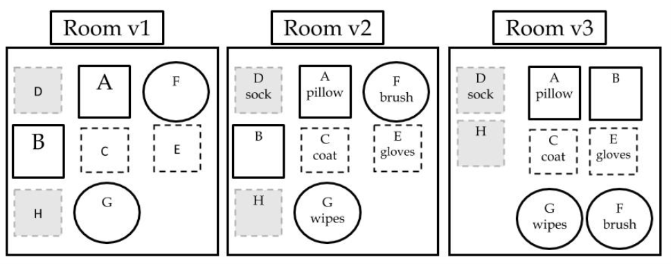

---
output:
  pdf_document: default
  html_document: default
---

## The Garden: Pri  
### LIFE, LOVE and DEATH  

Many people believe in seeds with special powers, 
like true love, or winning the lottery. 
One seed grows the duration of your life, 
which you rarely notice but are often aware of. 
When you eat it, 
the sun sets for  
the last time and you bite the dust. 
Think about this, but don't dwell on it. 
It happens to all of us.  
  
Think of what you can grow from the seeds of the best apple in  
your crop, which you tended to with dedication and skill. 

*REALITY*
Think of what's happening  
right this very moment: 
nothing in your garden, 
while you're sitting  
here thinking. 
Reflect only enough to improve your actions.  
  
Your garden allows you 
to ground the many goals of your life 
into a medium the mind is well-equipped to analyze: 
visual space. 

Maybe it  
seems unnecessary to represent work satisfaction and relationship  
quality in terms of carrots and tomatoes. 

When you arrive at the moment  
of boredom or frustration in attempting to put your life in terms of  
concrete IDEAS and actions between them (LINKS), 
ask yourself why you  
are bored and frustrated attempting to define 
the things that apparently  
define you. 
What is happening in your life, 
and what is in your control  
if these are unclear? 
If you are not reflecting on your life, 
your garden is a foggy labyrinth and 
you are a drunk gardener wearing  
oven-mitts.  

### Bad days
Maybe you are sick,
down or depressed.

Do not look out onto your field 
as a day to work.
You have assumed your field is only meaningful 
for its future.
Today your field gives to you, and 
you should take what you need.
This is what it is for.
Do not beat yourself up 
for what you cannot give today.

Instead, prevent the urge to be disappointed
the next time you are less than productive,
by planning a fact of being human:
you are always sometimes less than productive,
and always occasionally 
in very inopportune times and ways.

## Ideas
  
All GOALs rely on a single, finite  
source of attention, and existence:  
you.  

Managing the set of goals in your life is   
the goal of PRI.   

At its best, this limiting fact
drastically improves the reality
of PLANs and GOALS.
At its worst, it is the most common
oversight responsible for bloated CHUD.

GOAL importance (PRIs) partly depends on context.
  
### SAVINGS    
completing an action  
that serves various goals.   
  
An example is Grouping.
(See Fig. 3)
Grouping works for  
IDEAS, PLANS, GOALS, or HOME things.

Figure 3.   

  

SAVINGs are illustrated as a function of GROUPs,
across three rooms. The same OBJECTs are: 
As you find them (Room 1),   
labeled clearly (Room 2), and  
grouped by function (Room 3).    
Letters reflect different things, and  
shape differences reflect different kinds of things.  

  
### TIME  

The constant (or denominator) for 
FORCES, FORGETTING,
PRI, and LIB.

## Plans
### PRI	
group GOALs by shared actions, places, or times.  
Make/group/keep, 
order, reduce in the order presented in Figure 4.
"A place for everything, everything in its place"

ALIGN SELF and VALUE
Adopt all your goals to REALITY ("above", e-you will die). 
Think about the sum of your GOALS, 

### TIME
Do not ignore time
Estimate durations accurately
for GOAL accomplishment

