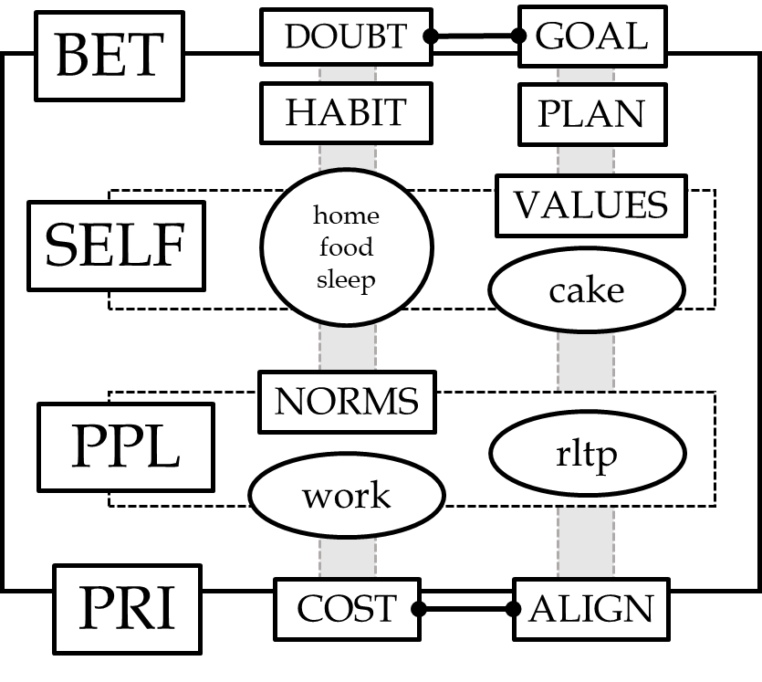

---
output:
  word_document: default
  pdf_document: default
  html_document: default
---

*Note for v2.12.* 
If you are reading this, you have an early copy of the 2nd version of this book. 
This copy is missing a few key sections in addition to other edits which remain before making it public. T
hank you for your patience in misunderstandings. 
I welcome any and all constructive feedback. Additionally, 
feel free to check back in for a revised and updated version if you please.

Dear Friend,  

You are going to die some day.
This book is for you if 
there is something in the meantime
worth maximizing.  

## how to read this book

I want you to engage your life.
This book is meant to help you 
break through mental barriers, 
into action, starting right now.

Please get a pencil and note the date and time, right now: \_\_\_\_\_\_-\_\_\_\_\_\_-\_\_\_\_\_\_ `YYYY-MMDD-HHMM`.

The words in this book
hold meaning only 
in your application
of them, to your life. 

If you completed step one, 
you have proven enough that 
you are open to trying new ideas.
You are prepared to grow,
and continue reading.

If you left the line blank, 
you might think tell yourself 
you are open to new ideas.
You will be right only 
when you complete the task. 

Either write the time above,
or stop reading and 
take a better action 
to improve your life, 
right now.

Every word you say to yourself
is at best a plan for action,
meaningliess until you take that action.
Consider every word I write
a plan to improve your actions.

Why was writing down the time 
the first action I asked you to take?
There are many things 
that explain themselves when you take action,
and are not worth the time to put into words. 
What is important will appear,
and what isn't will be forgotten.
Never forget the time, though.

## camp homeless
this book describes
obvious facts of life.
Very little should surprise you,
because it
falls awfully close to reality.

So let me offer
two experiences as examples
to help illustrate the point:  

### 1. go camping  

When you prepare to go camping, 
you overpack, 
are late or unprepared.

planning and executing your life is 
not fundamentally different.

If you're not unprepared or late to camp,
you've learned from mistakes.
We don't have past lives 
to learn from.

You are very likely late to your own life.

The reason is a disconnect between
your mind's reality,
and the one you are physically acting in.
It can be described in many ways,
and all of them are versions of a single error:
miscalculation of time on task.
The most common version of this is
forgetting necessary subtasks for an intended task.
Another is that you simply don't do the things you think you will.
The result is you will die in two worlds,
the world you imagine you could have lived,
and the one you did.

Part one, 
the Garden, 
is a tool for remedying 
all the knowable versions of this problem.

### 2. be homeless  
  
The odds are you 
haven't been homeless,
but imagine the closest experience
you've had.
You couldn't find your car in the middle of winter,
or you went camping without waterproof gear and it rained.
In the first moments,
there is shock and terror,
frustration and suffering.
Your habit
protests for a change in plans.

In any environment,
even far into the spectrum of clear suffering,
habits will acclimate in time.
what you call suffering
will change. 

Now, suppose you are hungry and
you have two choices to pursue:
food, or cake.
In your pre-homeless life,
often you can have food and cake,
but when it is a choice, you should choose food.
Throughout this book, 
Food refers to needs and 
Cake refers to wants.

**PAUSE HERE.**  
"When it is a choice, you should choose food."
This is a claim about action. 
This books makes many claims of this nature 
(presuppositions) that 
you will need to accept
either instantly,
or take the time to arrive at a similar view.
This book cannot help anyone
who values hypotheticals
more than the practical truth.  
**RESUME**  

To make sure you are on time for life,
the single most important mental decision to make
is to identify the Food and Cake in your life.
Always gaurantee Food is 
identified and first to be packed.
What time remains before you need to go (act),
may be spent thinking, trying out,
and admitting which pieces of Cake to bring.

Often, extreme experiences 
like being homeless or taking a cold shower,
help illuminate the difference between Food and Cake,
what really matters,
and what you can live without.

Part two is 
a group of guidelines for
sharing ideas with the goal of 
identifying what matters.
The key arguments are radical application of
brevity,
value-assessing, and 
clarity.
These are accomplished with concrete guidance on actions.
Figure 1 highlights key IDEAS and 
their basic associations,
to reduce potential confusion with lay-definitions.

  

### Figure 1  
The relationship between core IDEAS of this book. 
These will appear throughout in capital letters. 
The first column refers to a Chapter,  
signifying broad themes (forces) 
under the words in the same row-box, fall.
Roughly, the second column contains
forces, concepts that require energy to deal with (food, work) or 
tend to work against your goals (doubt, habit),
and the last column suggest ideal goals (e.g., cake and relationship) and strategies (plan and align).

Circled concepts are Example Goals. 
All boxes are forces or attributes of them.
Roughly, 
words are arranged by association strength,
in terms of row, column, and boxes. 
The particular relationships are 
too complex to summarize, and 
the subject of respective chapters.

## The Garden

The Garden foregrounds the things 
we often lose sight of 
when conceptualizing life goals: 
life is brief and we are mortal.
The Garden describe the key IDEAS of this book.

Your imagined garden
is a mental model of reality, 
strategic and powerful 
in bringing clarity. 
You need the Garden to combat 
the other strength of your mind,
its inherently idealistic nature, 
which sets you up 
for failure and suffering. 

### IDEAS and Plans  
The second part of each chapter,
"IDEAS and Plans" provides
additional concrete language 
to the key IDEAs and claims
in that chapter.

IDEAS (ALL CAPS) and claims are always 
describing some, but not all sense(s)
For example "WORK" is an IDEA referring to "careers",
but not 'yard work'. 
Claims assume not that they are always relevant,
but in the cases where they are self-evidently relevant,
they are precisely the valuable way to think about the IDEAs.

Generally, this is to give
IDEAS measurable, consequential meaning
(See WORDS).

A special case of plans is a LESSON (See SR).
The LESSONS are much like "The Garden",
meant to activate 
relevant parts of your reality or beliefs,
in a way that applies
the IDEAS introduced.
They are exercises that
take between 10 and 60 minutes to complete.

## Version
This is the second version of "Skilled Reflection".
The first version was under 20 thousand words. 
Since the first version I have taught an Undergraduate course that tested much of the core principles of the words--action premise. The result is deeper integration between ideas and clarification. A second result is that I am explicitly aware that my communication can be confusing and disorganized. Treat this either as your final suggestion to stop reading, or encouragement to read between the lines.

