---
output:
  html_document: default
  word_document: 
    reference_docx: "template.docx"
title: Game
editor_options: 
  markdown: 
    wrap: sentence
---

## Introduction

The following is a description for the Skilled Reflection game, a hands-on way to learn and apply Skilled Reflection concepts.

## Mode 1

1.  Identify in the cards what it is that is on your mind.

Each card deals with a dimension that is relevant to most ideas.
Here are two example translations of an idea into the cards' concepts.

> *I won't tolerate my friend's jokes anymore, and I'm going to focus on my emotional health.*

|------------------------|--------------------------------------|
| I won't tolerate       | Card 0 - "bet" ; Card 9 - "away"     |
| my friend's jokes      | Card 3 - "partner" ; Card 7 - "play" |
| I'm going to focus     | Card 12 - "point" ; Card 6 - "next"  |
| on my emotional health | Card 1 - "life"                      |

2.  **Explore comparison statements.** Once you have identified the basic description of your experience, you are ready to consider the bigger picture. Each concept associated with your idea, is related to other concepts on the card. Experiment with how the description would change if you swapped out concepts.

    In the example above, changing Card 0 to "feel", and Card 3 to "people" our comparison description looks something like:

    > *I won't let myself feel hurt anymore, by anyone's jokes.*

    The purpose of comparison statements is not necessarily to change your plan, but to better understand it. It will often lead to insights and sometimes to a better description. By noticing which cards are "flexible" and which are not, you begin to gain insight on the dimensions of your feelings, what is possible and what isn't. Explore until you have identified the most relevant components.

    Hint: The lower the Card number, the more significant it is to consider alternatives.

3.  Once you have arrived at the full range of your experience, the only thing left is to get out of your head, and live it.

<!-- *What is the biggest political danger we can fix, today?* -->

<!-- See if you can match the words to the following cards: -->

<!-- a.  What is the biggest: question (#8) point (#12) -->

<!-- b.  political danger: people (#3) danger (#away) -->

<!-- c.  we can fix, today: family (#3) answer (#8) today (#5) -->

## Mode 2

This is an exercise in developing and communicating the specific, unique aspects of your life. In a world of billions, much of who we are is a variation of others.

0.  Start with a defining characteristic of your personality.
1.  **Read Card #3.** How many other people would say the same of themselves?
2.  **Read Card #6.** What ways does this differ?
3.  **Using cards #7-#12,** move your self description away (#9) from all other people until you are describing what can only be uniquely to you, and only you can know and understand.

## Card Basics

The green cards (Numbered 1 - 6) are a map of your physical, lived reality.
All ideas require at least one of the green cards.
Contrast that with the black cards (7-12), which deal with ways you might change how you view your reality.
Card 0 reflects how you personally relate to the experience.

On each card are four concepts: either two pairs of independent but similar opposites (IP), two linked pairs of opposites (LP), or four degrees of a single concept (4D).
Each of the four concepts are in quotes under a single card description.

The first step is to identify which of the four sides of the card is closest to the way you are thinking of your idea.

Below is a brief description of the concepts on each card.
In most cases, the word written is meant in a specific, narrow sense, and only works if you keep to that narrow definition.
For example, the word "Play" (#7) is more of an adjective than anything else, referring to an imaginative, exploratory experience.
If you are thinking of going to the park on your day off, this is "Cake" (#2), not "play".

# Cards and concepts

## Level (IP)

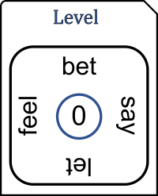

These are degrees of commitment to your thought.
The biggest commitment is to "bet" on your idea, by setting a deadline and a consequence to the outcome, and attempting to live your idea against these conditions.
The smallest but sometimes just as profound, is to simply "let" something be as it is (Buddhist).
The lighter version of bet is to commit to only thinking what you are willing to "say" or stand by.
The stronger version of "let" is to intentionally listen to what you "feel" in regard to your idea.

## Cards 1 - 3

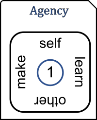 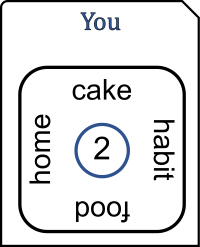 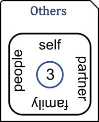

### Agency (IP)

You are constantly interdependent with others.
You, act for either your own survival and well-being is "life", whether it is your cake or food (#2), or that of an "other", whether your 2-year-old or boss.
The micro actions speak to the give-and-take of needs: "make" is to give, whether for work or for personal life, and to "learn" is to find or take.
What are your defaults?
Is one mode more challenging than another?

### You (LP)

Everything that you intentionally pursue or conceptually desire is "cake".
"Food" is everything that keeps you alive or fuels you to pursue cake.
"Habit" is the pattern of consumption, whether food or cake.
Changing your habit is hard, but the simplest way to get the cake you want.
"Home" is the material equivalent of habit: your daily environment, technology and possessions.
Modify "home" to help change habits that facilitate your food and cake.

### Others (4D)

If it deals with no one else, and no one else would benefit by knowing, then it is your "self" alone.
If not, is it one other person ("partner"), a few significant people ("family"), or every imaginable person ("people").
What happens to the idea if you change the number of others?

## Cards 4 - 6

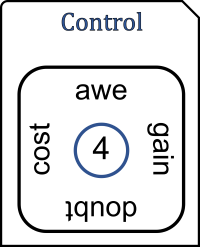 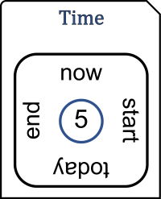 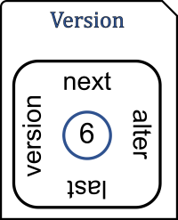

### Control (LP)

What are the "costs" and "gains" that are the outcome of your thought?
Notice whether you are dwelling on one side more than the other.
Be aware of how much is outside of your control or understanding.
It is very common to forget this, in which case the effect is "doubt"-- a position of defensiveness, resistance, irrational over-exertion, fear, anger.
You can engage the same facts of the unknowns with curiosity, openness, "awe".
Awe is almost always the point (#12).

### Time (LP)

The only real time is "now", but it is often practical to think about "today".
Beyond these immediate scopes, everything you can think of is either in the past or the future.
Compare any thoughts about the past against your life story until now, since the "start".
Everything until the "end" in the future is a bet.

### Versions (IP)

The most relevant version of the idea is the "next" one.
What improvements can you make right now?
"Style" is the recognition that saying the same idea differently can help, especially if someone else needs to hear it.
Other times, an "alternate" approach may be necessary.
If you wanted to turn left, what does it mean to turn right?
What is the difference from the last time you were engaged with a similar thought?
Perhaps appreciate the improvement, or embrace the tried-and-true.

## Cards 7 - 9

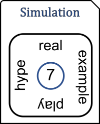 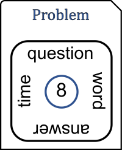 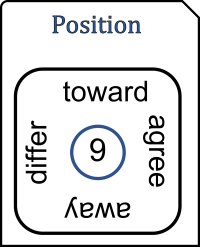

### Simulation (IP)

All thinking is "play", a mental simulation of reality.
You can think of reality, in which case your mind is aligned with the world.
Differentiate between what is clearly "real" and then deliberately "play" with the thought by entertaining what could be, and how you could manifest it.

The second axis of this card is the subtler and often more helpful realization of the same point.
All thoughts can be classified as either an "example" of what really happened or is happening, or as a hypothetical ("hype") of what might be.

### Problem (LD)

At the heart of an idea is a problem.
A "question" is all the parts that are required, given or assumed.
The "answer" is what the idea means, and ideally, a directive to take action in reality.
Don't overthink the "words" of your point, and don't spend too much "time" making your point.

### Position (LD)

Any idea is one you can "agree" or "differ" on.
"Differ" is to generate an alternative (#8).
When you say or act to connect or support their best interests or your connection to them, this is "toward" them.
Conversely, notice if, underneath your words, your point is to move "away" from them, or express your individuality.
Habits of agreement and away can lead to confusion.

## Cards 10 - 12

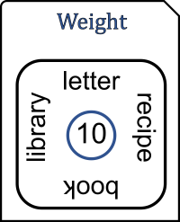 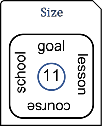 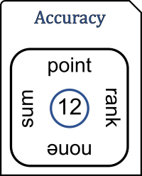

### Weight (4D)

The amount of mental content required to process or overcome your thought.
A "letter" is a reminder or mantra.
A "recipe" requires multiple conditions or materials, and multiple actions.
An idea that requires a "book" requires proper context in order to execute the recipe.
A "library" incorportates things beyond the immediate context; interrelated recipes, peoples, goals, etc.

### Size (4D)

This card is a complement to Card 10 (you may not need both).
All four concepts are variations of a "goal".
The point of a "goal" is to go for it, so it's always preferable to do less thinking and more doing.
"Lesson" implies the answer requires about an hour of reflection: challenging, refining and planning initial steps.
A "course" requires a significant time commitment, because a modest amount of training or practice is required in order to be capable of accomplishing what you would like, whereas "school" suggests that mastery or fluency is required.

### Accuracy (IP)

The "point" is to fixate on the key cause, property, or priority, especially if the size of the idea is a burden.
"Total" is to take the alternative by assuming every aspect is a critical priority.
"None" is to reject the top priority.
What does it look like to reject the goal or put almost no effort toward it?
To generate perspective, "rank" the importance of every alternative.
