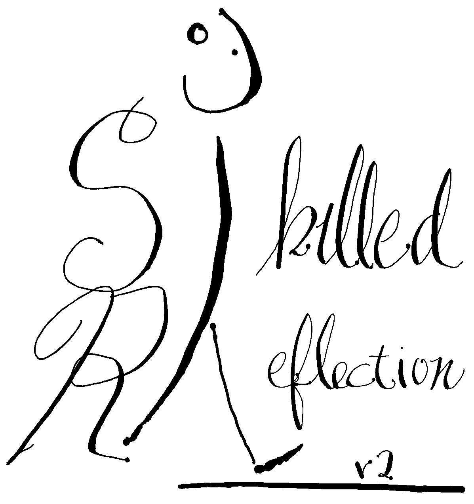

## [An Identity Workbook](_book/index.html)

version 2.15 is an abreviated manual (under 15000 words!) with the goal of giving you all the tools you'll need to master the precise SELF you're after. Without having to tell a single soul. (SELF-assembly required.) 

## A Club
A journaling club with purpose: yours.

Habits and reality have a tendency to sneak between our intentions and actions.
A little Skilled Reflection will make reality more like your plan. 

For 3 years, we've been a Student Organization 
at the University of Wisconsin-Madison 
that meets every few weeks to write privately for about an hour.
Each session focuses on specific themes related to identity, goals, and being a student, with prompts for you to reflect and write on.

Read about us in the [Psychology Department Bulletin](https://psych.wisc.edu/news/when-personal-experience-meets-psychology-michael-koranda/).

  

[Typical Session](_posts/every_session) . [About](about.md) . [Events](club_meetings.md) . [Instagram](https://www.instagram.com/skilledreflection/)
[Book](_book/index.html)
Intervention: Describe yourself in [250 words](self250.md).  
