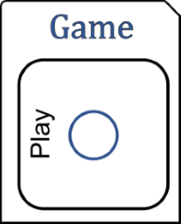
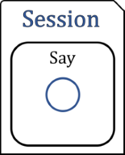
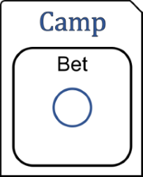
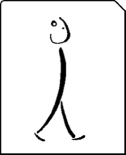

### Level-Up  

 

### More  

 

## [Book](_book/index.html)

Skilled Reflection v2.15 is an abbreviated manual of the tools that'll
help you shape the precise SELF you're after without having to tell a
single soul (some SELF-assembly required).

## Camp (Coming Soon)  

Over the last few years, Skilled Reflection methods have been developed and refined with students in various course formats: semester-long, club, and a week-long intensive. Slated for late summer, 2023, the next phase of Skilled Reflection will be more immersive and interactive than ever before. Contact us to stay informed.

## Club

A journaling club with purpose: yours.

Habits and reality have a tendency to sneak between our intentions and
actions. A little Skilled Reflection will make reality more like your
plan.  Each session focuses on specific themes related to
identity, goals, and being a student, with prompts for you to reflect
and write on. Read about us in the [Psychology Department
Bulletin](https://psych.wisc.edu/news/when-personal-experience-meets-psychology-michael-koranda/).

